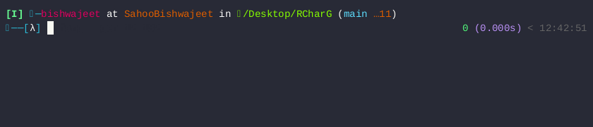
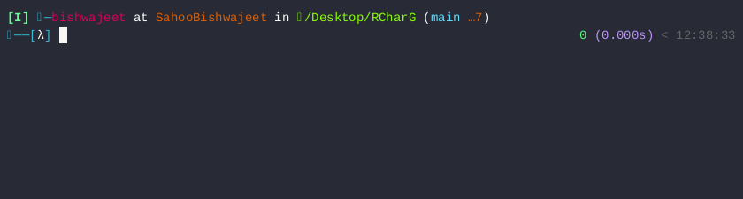

# RCharG - Random Character Generation In C

RCharG is a C-based tool that generates random character sequences with both Text-based User Interface (TUI) and Command Line Interface (CLI) interfaces. It can generate sequences of upto a length of 6000 characters, including a combination of lowercase letters, uppercase letters, numbers, and symbols.

## Table of Contents

- [About](#about)
- [Dependencies](#dependencies)
- [Installation](#installation)
- [Usage](#usage)
- [Uninstallation](#uninstallation)
- [License](#license)

## About



RCharG is a simple yet powerful tool written in C for generating random character sequences. Whether you need strong passwords, cryptographic keys, or any other form of random data, RCharG has you covered. The tool provides both a TUI and a CLI, making it versatile and easy to use in various environments.

## Dependencies

RCharG relies on [ncurses](https://invisible-island.net/ncurses/), so please make sure to install it before building and running RCharG.

### Installing the ncurses library in Debian/Ubuntu Linux

```bash
# Using apt
sudo apt-get install libncurses-dev
```

```bash
# Using pacman
sudo pacman -S git ncurses make gcc
```

### Installing the ncurses library in CentOS/RHEL/Scientific Linux 6.x/7.x+ and Fedora Linux

```bash
# Using yum
sudo yum install ncurses-devel
```

### Installing the ncurses library in Fedora Linux 22.x+

```bash
# Using dnf
 sudo dnf install ncurses-devel
```

## Installation

To Install RCharG, follow the steps below.

```bash
# Clone the Repository (http)
git clone https://github.com/SahooBishwajeet/RCharG.git
```

```bash
# Clone the Repository (ssh)
git clone git@github.com:SahooBishwajeet/RCharG.git
```

```bash
# Enter the Project Directory
cd RCharG
```

```bash
# Compile and Install
sudo make install

# Remove generated Object files
make clean
```

## Usage

To run the Random Character Generator program, enter the TUI by typing the following command.


```bash
# Run the Program
rcharg
```


Add the help flag to show Usage.

```bash
# Show Usage
rcharg --help 
```


Directly generate Random Characters by using the gen flag

```bash
# Generate Random Characters direclty
# 1 <= size <= 6000 || type = [1,2,3,4]
rcharg --gen [size] [type]
```

## Uninstallation

To Uninstall RCharG, follow the steps below.

```bash
# Uninstall & Delete all
sudo make clean uninstall
```

## License

RCharG is licensed under the [MIT License](LICENSE).

The MIT License is a permissive open-source license that allows for the use, modification, and distribution of the software for any purpose, provided that the original copyright notice and the license text are included with any significant portions of the software or documentation.

For more details, please refer to the [MIT License](LICENSE) file.
